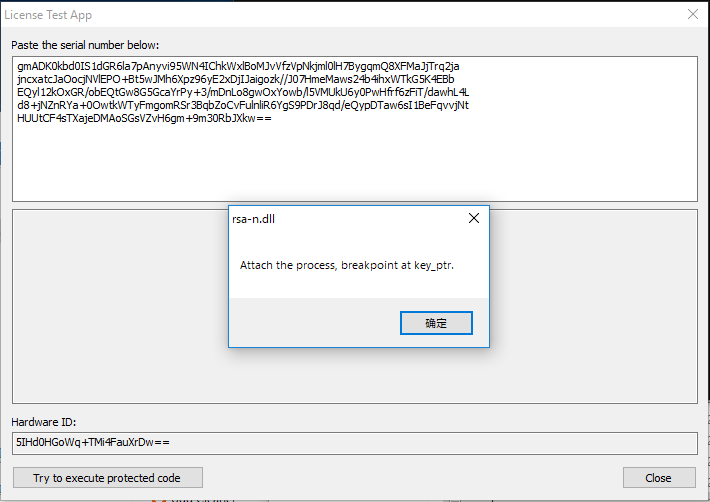
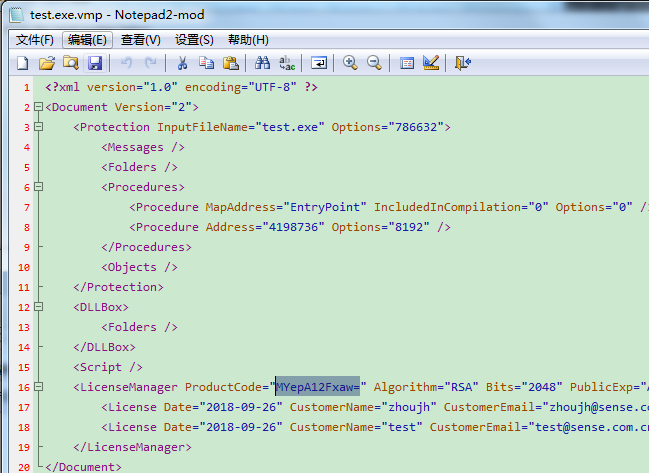
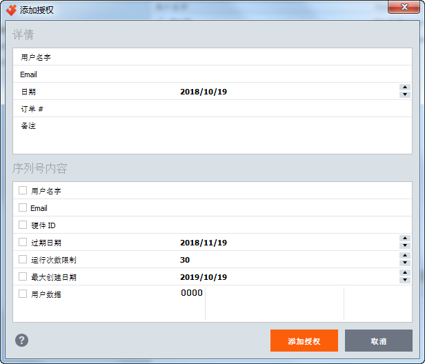

##### 说明
来自：VMP3.2授权分析 - HighHand

https://bbs.pediy.com/thread-247442.htm

没测试过，擦汗。

##### 破解分析

下面提供几种破解方法，通过分析利弊选择方法3进行破解分析。

```
1.   找到VMProtectSetSerialNumber并修改返回值进行破解，由有虚拟化或混淆进行保护比较难找到并且每个程序每次加壳后都需要重新分析确定函数地址方可实现，通用性无法保证。
2.   替换程序中的RSA公钥，首先需要定位RSA-N，由于N的存储进行了加密，无法在文件或内存中进行扫描得到。必须进行虚拟机逆向分析出N的加密算法和密钥，通过特征数据定位内存中的N进行替换。此方法通用性较佳但分析虚拟机和特征定位非常困难，此方法为完美破解同时也需要一定的技术。
3.   通过HOOK特定API，在关键点对RSA-N进行修改替换达到破解的目的。VMP中N在内存里也是被加密的，N在计算过程中不会出现完整的明文N，所以为了替换N还需要分析部分虚拟机加密算法，但工作量远远小于2的方法。
```

##### 程序说明
- launch.exe
     主程序，启动程序用于辅助注入DLL，参数如下：
     Launch.exe [-n] <exe_file> [exe_cmdline]
     -n 用于注入 rsa-n.dll 否则注入 crack.dll
     
- Gen.exe
     通过读取rsa-n.bn 和 serial.txt 解析序列号获取相关信息。（serial.txt中的序列号是有效序列号）
     
- Rsa-n.dll
     辅助获取原RSA-N 的注入DLL
- Crack.dll
     替换原RSA-N 的DLL

==============================================

##### 获取现有RSA-N

Tip: rsa-n.dll的源码就是crack，在编译选项中切换。

cmd.exe中运行launch.exe TestApp.vmp.exe。输入正确的serial序列号



没继续下去，使用的OD不给力，略。

找到rsa后保存为ras-n.bn。

==============================================

##### 许可生成

1、解密序列号。运行gen，解密出数据

```
user:cxd
email:cxd@2126.com
product code:MYepA12Fxaw=
data:
ff ff
```

2、修改test.exe.vmp工程的ProductCode

使用文本打开现有.VMP 配置文件找到ProductCode，将该值替换为原序列号中的ProductCode，保存。



3、打开test.exe.vmp，在添加授权中添加使用VMP加壳工具发许可。获取现有RSA-N 加入hook程序中，制作DLL 进行注入。




